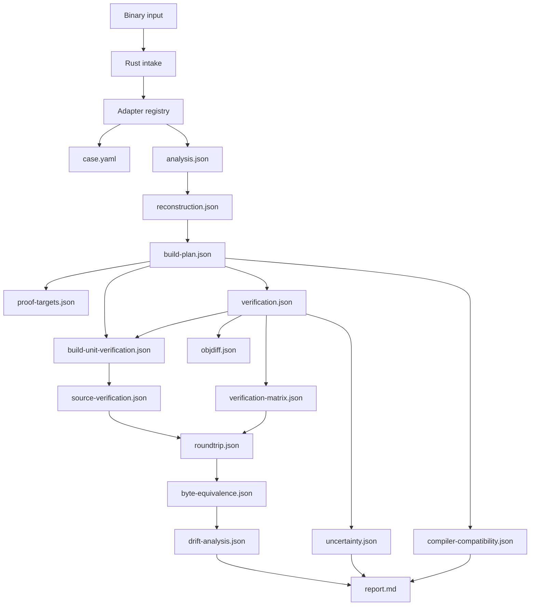

# Rust Core Orchestrator

This document defines the first production Rust slice for Mizuchi. The Rust core is
the product-facing runtime that grows around the existing proof-aware shell workflow
without weakening the current `objdiff 0` invariant.

## Product role

The `decomp` binary owns target intake, workspace materialization, typed reports, and
truthful failure state. It does not pretend that arbitrary binaries are fully recovered
when only structural evidence is available.

The current Rust intake surface accepts:

- raw binaries / object files / archives
- a prompt directory containing `case.yaml`
- a direct `case.yaml` path

When a case manifest is imported, Mizuchi preserves the case/proof contract and prefers
the local proof target object as the analyzable artifact when that is the strongest
available exact-match surface.

`decomp status --project ./output` now exposes more than a coarse run summary. It also
surfaces ranked `topAttempts` and `nextActions` derived from the current attempt matrix,
so operators and future automation can see which rebuild moves are most worth trying
next without inferring that from several separate files by hand.

Current commands:

```text
decomp <target> [--project ./output]
decomp <target> --rebuild
decomp <target> --verify
decomp <target> --match
decomp status --project ./output
decomp report --project ./output --format json|md
decomp adapters --format json|md
```

## Runtime data flow



The generated workspace is intentionally file-first:

```text
output/
├── case.yaml
├── analysis.json
├── reconstruction.json
├── cfg-evidence.json
├── type-relations.json
├── dependency-graph.json
├── build-plan.json
├── proof-targets.json
├── compiler-invocation.json
├── build-unit-verification.json
├── source-audit.json
├── source-verification.json
├── build-graph.json
├── build-manifest.json
├── toolchain-manifest.json
├── attempt-matrix.json
├── upstream-evidence.json
├── compiler-compatibility.json
├── verification.json
├── verification-matrix.json
├── roundtrip.json
├── byte-equivalence.json
├── drift-analysis.json
├── uncertainty.json
├── objdiff.json
├── report.md
├── build/
├── build-system/
└── sources/candidates/
```

`objdiff.json` is now generated as a project-level verifier scaffold, not just a thin
placeholder. It carries project metadata, watch/ignore patterns, progress categories,
scratch compiler/context hints, and verification status options. `units` are now derived
from `buildUnits`, so each objdiff row maps to an actual compile boundary instead of a
free-floating source candidate. When a truthful proof target exists, Mizuchi emits a
project-local `build-system/compile-unit.sh` wrapper that accepts objdiff's object-path
build contract and resolves it back to the corresponding candidate source. The wrapper
stays intentionally blocked until a real compiler invocation is recovered; Mizuchi does
not fabricate objdiff units or pretend a compiler driver exists when it does not.

`reconstruction.json` and `build-plan.json` now also model explicit project structure:

- `projectStructure.translationUnits` records truthful source-to-object boundaries
- `projectStructure.linkUnits` records current artifact/link boundaries
- `functions` records symbol-derived function boundaries with explicit unrecovered CFG
  status
- `buildUnits` records the exact compile boundary that must be proven
- `toolchain.stages` records unresolved compile/assemble/link/runtime/configure stages
- `linkPlan` records import-table inputs, runtime/debug sidecars, and linker-facing blockers

This keeps the workspace honest for one-shot reconstruction goals: Mizuchi can say
"there is one blocked translation unit with these candidate compiler families and these
missing inputs" without claiming it already recovered real source logic or a complete
project tree.

For static libraries, the same contract now scales to archive members: Mizuchi can emit
one blocked translation unit and build unit per parsed archive member while still keeping
archive index behavior, librarian invocation, and per-member proof targets explicitly
unresolved.

Function boundaries are now first-class analysis evidence. They are derived from native
text symbols when available, carry confidence and `cfgStatus`, and remain separate from
source candidates. This gives later recovery and CFG analyzers a typed work queue without
turning symbol names into fabricated function bodies.

`cfg-evidence.json` extends that boundary into a CFG-readiness ledger. It records which
functions have only boundary evidence, which required CFG facts are missing, and why
`cfg_comparison` remains blocked. The Rust slice intentionally emits no basic blocks or
edges until an analyzer provides instruction-derived evidence and a rebuilt candidate CFG
exists for comparison.

`source-audit.json` is the policy gate for generated source artifacts. It records whether
candidate files are marked blocking stubs, whether they intentionally fail compilation,
and whether they contain unmarked placeholders, hardcoded address literals, or fabrication
markers. Passing this audit does not prove recovery; it proves Mizuchi did not quietly
promote scaffold text into recovered source. Imported prompt-case candidates such as
`trial.c` now flow through the same audit path as `unverified-source`: Rust can rebuild
and diff them, but it still keeps source recovery blocked until proof and invocation
evidence establish that the candidate is verified recovered source.

`build-unit-verification.json` is the per-build-unit proof-attribution ledger. It joins
`build-plan.json`, `compiler-invocation.json`, and `verification.json` into explicit rows
for each compile boundary, recording whether proof was actually attributable to that unit,
whether rebuild/object/binary checks passed, and whether exact invocation recovery exists.
This replaces the older implicit single-unit assumption in source promotion: a byte match
for one candidate source no longer implies that unrelated units, archive members, or
workspace-global sources are verified.

`verification.json` now carries the companion `buildUnitProofResults` rows that feed this
ledger. That gives Mizuchi a place to record authoritative per-build-unit rebuild,
objdiff, and native byte-comparison results. For common non-thin `ar` archives, Mizuchi
can preserve raw archive container evidence, replace member payloads with rebuilt objects,
and record a top-level archive/package byte comparison. Thin archives and raw layouts that
do not align with analyzed build units remain explicitly blocked.

`proof-targets.json` is the proof-surface mapping ledger that sits one step earlier. It
records how Mizuchi translated the configured proof artifact into per-build-unit proof
targets: direct-object paths for single-unit cases, extracted member objects for archive
cases, or explicit unmapped states such as missing proof sources, thin archive members,
and unmatched members. This means an archive proof path is no longer treated as proof for
every member just because one top-level path existed.

`source-verification.json` is the promotion ledger that sits after audit and proof. It
classifies each source artifact as a marked blocking stub, an unverified source, a
byte-proved candidate, a policy violation, or a verified recovered source. A
byte-proved candidate means rebuild, objdiff, and native byte proof all passed for the
current candidate, but Mizuchi still lacks exact compiler invocation recovery and
therefore must not present the source as fully verified recovered logic.

For archive/static-library cases, member-level byte proof can advance the source and
build-unit ledgers to `byte-proved-*` states before exact invocation recovery exists.
`roundtrip.json` and `byte-equivalence.json` only advance further once Mizuchi can also
reproduce and compare the top-level archive/package artifact. Today that package proof is
implemented only for simple non-thin archives with no special symbol/name-table members.

Source promotion now flows through the build-unit ledger. Each source artifact can only be
promoted when Mizuchi can point to a specific build unit with proof attribution and,
ultimately, exact invocation recovery. For archive/static-library cases, units without a
real per-member proof target remain explicitly `proof-unavailable` instead of being
misattributed as failed or matched source recovery.

## Adapter model

Adapters are the boundary between raw target inputs and the normalized reconstruction
workspace. The Rust registry currently names these families:

| Adapter | Role |
|---------|------|
| `odyssey` | Existing Ghidra/Mizuchi proof path for Odyssey/Xbox-style cases |
| `elf-ps2` | Fixture-backed second-family path for PS2 ELF style cases |
| `elf` | Generic native-object probe and report path |
| `pe` | Generic PE/COFF probe and report path |
| `macho` | Generic Mach-O probe and report path |
| `static-lib` | Static library/archive probe-only path |
| `firmware-blob` | Raw firmware/blob probe-only path |

The registry is discoverable with `decomp adapters --format json`. New adapters should
extend the registry and provide the same normalized outputs instead of adding
target-specific branches to the orchestrator.

Adapters now also carry an explicit `analysisProviders` chain. This separates the
operator-facing load surface from the backing analysis/parsing systems. For example,
an Odyssey case can truthfully say "tool is `agdec-http`" while also recording that the
backing analyzer is Ghidra. Generic ELF/PE/Mach-O cases can record a `native-object`
parser without implying that a decompiler or scripted analyzer was involved.

`analysis.json.toolAvailability` now mirrors that provider model. Availability is typed:
some providers are command-backed (`ghidra` via `analyzeHeadless`), some are
workspace-configured (`agdec-http` via `.cursor/mcp.json`), and some are in-process
runtime capabilities (`native-object`, `raw-inspector`). This avoids conflating all
analyzers into one PATH check.

Provider availability is also promoted into verification and status. Missing external
analyzers now produce a dedicated advisory verification check and status/report summary so
operators can distinguish infrastructure gaps from proof-target gaps and semantic recovery
unknowns.

## Verification methodology

Verification is explicit and may be blocked. A generated source candidate is not proof.
An imported prompt candidate is not proof either; it is only a more useful input to the
same proof pipeline.

Required proof layers:

- `object_match` uses `objdiff` when a golden object and candidate object exist.
- `rebuild_proof` records whether the candidate source rebuilt into the expected object.
- `binary_diff`, `section_comparison`, `symbol_comparison`, and
  `relocation_comparison` record native target-vs-candidate artifact comparison when both
  files exist. A byte mismatch is a verification mismatch; inventory comparison remains
  advisory evidence for triage.
- `binary_fingerprint`, `section_inventory`, `symbol_inventory`,
  `function_boundary_inventory`, `cfg_inventory`, `relocation_inventory`, `dependency_inventory`,
  `debug_inventory`, and
  `toolchain_fingerprint` record native `object` crate evidence from the input binary.
- `cfg_inventory` records boundary-only CFG readiness and unresolved basic-block/edge
  evidence without claiming CFG comparison.
- `type_relation_inventory` records symbol/type relationship evidence such as mangling
  status, unresolved function signatures, RTTI/vtable candidates, and template hints.
- `cfg_comparison` and `symbol_type_comparison` are advisory until native analyzers and
  rebuilt outputs are available.
- `source_artifact_audit` records whether generated source artifacts obey the no
  fabricated-source policy before any rebuild proof is attempted.
- `compiler_invocation_contract` records whether exact compiler command recovery exists;
  it is advisory until paired with rebuild proof and object/binary diff proof.
- `uncertainty.json` is a first-class artifact, not a comment bucket.

Native inventory checks can pass while the reconstruction remains blocked. They mean
Mizuchi extracted verifiable input facts such as section, segment, symbol, dynamic
symbol, relocation, import, export, debug-link, build-ID, entrypoint, size, hash, and
literal toolchain-comment records; they do not mean recovered source is semantically
complete or rebuildable.

Native artifact comparison complements `objdiff`; it does not replace `objdiff 0` as the
current matching proof invariant. It gives deterministic byte and inventory evidence even
when `objdiff` is unavailable, and missing `objdiff` remains an infrastructure failure.

`verification.json` also includes a `matchScore` matrix. The score is a ranked confidence
summary over object proof, binary bytes, rebuild proof, section/symbol/relocation
comparison, CFG/type evidence, and native inventories. It is intentionally separate from
the verifier status: advisory evidence can contribute score for triage, but only
non-advisory proof such as `objdiff 0`, byte equality, and rebuild proof can establish a
match. Failed non-advisory proof keeps the score status at `mismatch` even when metadata
inventories were extracted successfully.

`verification-matrix.json` derives an explicit proof matrix from `verification.json`.
Rows are grouped as `authoritative`, `advisory`, or `policy` so the CLI can show which
round-trip checks actually prove byte equivalence. Object match, binary diff, and rebuild
proof are authoritative; CFG, type, dependency, debug, relocation, and native inventories
remain advisory unless paired with binary/object proof; source-output and exact compiler
invocation rules are policy gates that block fabricated recovery.

Inspecting Ghidra's `DecompInterface` and clang/gcc driver sources reinforces that
boundary: decompiler configuration, job construction, response-file handling, and
environment-sensitive driver behavior are real subsystems. Mizuchi may reuse their
evidence and interfaces, but a nearby replay script is not equivalent to recovered target
compiler intent. The Rust orchestrator may promote a configured replay command only after
authoritative rebuild/diff proof plus a source-sensitivity probe show that the source
participates in the rebuilt artifact; original compiler executable/version identity
remains unclaimed until independently proven.

`roundtrip.json` is the end-to-end source→build→object/binary proof ledger. It stays
blocked until source recovery is non-scaffold, exact compiler invocation is recovered,
rebuild proof passes, objdiff proof passes, and native byte comparison passes. This is the
artifact that should answer "did the round trip actually produce byte-equivalent output?"
without requiring the operator to mentally join several ledgers.

`roundtrip.json` now depends on `source-verification.json` rather than only raw candidate
status. That breaks the old circularity where a source artifact could never become
"verified" because the round-trip proof was itself the only place recording that status.

`byte-equivalence.json` is the narrow raw-byte ledger. It records whether the proof target
and candidate artifact were both available, whether their bytes match, whether native
section/symbol/relocation inventories match, and which verification rows still block a
byte-equivalence claim.

`drift-analysis.json` classifies the reasons the current reconstruction would drift from
byte-equivalent output. It groups source, compiler, CFG, type/layout, dependency, proof,
binary, and infrastructure gaps while keeping missing tools separate from semantic
decompilation difficulty.

## Build plan contract

`build-plan.json` is evidence-derived. It records the target format and architecture,
the expected candidate artifact, the comparator that must prove it, required rebuild
inputs, unresolved dependencies, and compiler/linker evidence gathered during analysis.
It is allowed to say `blocked`; it is not allowed to invent compiler flags, linker
inputs, toolchain versions, source language semantics, or object paths.

`analysis.json` now also carries a `platformFingerprint`. This records object format,
pointer width, vendor, operating-system family, environment, binary-interface
hypotheses, and target-triple candidates. Those fields are intentionally evidence-first:
they may remain partially unknown, but they give later recovery stages a truthful place
to reason about compiler ecosystems such as GNU ELF, MSVC PE/COFF, MinGW, Apple Clang,
or MIPS-era console toolchains without collapsing them into one guessed compiler string.

The toolchain plan includes candidate compiler profiles. These profiles are not
implementations and are not selected by default. They enumerate the compiler family,
required frontend/backend/assembler/linker/runtime/configuration components, and the
evidence that made the family plausible. A profile becomes selected only after exact
version, ABI mode, flags, libraries, and rebuild/diff proof are recovered.

Build units bind those profiles to a concrete source/object/proof boundary. This matters
for exact matching because a project may eventually need several translation units and
several toolchain stages, not a single global "compiler" string.

`type-relations.json` records the type side of reconstruction separately from source
emission. It can capture mangled-name families, RTTI/vtable evidence, possible template
or generic instantiations, and unresolved function signatures, while explicitly refusing
to invent class layouts, inheritance, calling conventions, parameter types, or return
types.

Link plans make the runtime dependency problem explicit. Imported symbols, CRT/runtime
components, debug sidecars, alternate debug links, framework-like dependencies, and
other linker-owned artifacts are modeled as unresolved requirements until Mizuchi has
real paths, versions, and rebuild proof. This is intentionally stricter than emitting a
generic "dependencies exist" note.

`dependency-graph.json` is the machine-owned ledger for those facts. It keeps imports,
exports, relocation edges, runtime artifacts, and link requirements queryable without
promoting them into source code or generated linker commands. Relocation offsets and
export addresses may appear there as metadata evidence only; exact sysroots, import
libraries, startup objects, library search order, and linker scripts remain blocked until
verified by rebuild and diff evidence.

The Rust slice now also emits build-system artifacts:

- `build-graph.json` — the compile/link/proof dependency graph
- `cfg-evidence.json` — function-boundary CFG readiness without fabricated edges
- `type-relations.json` — symbol/type relationship evidence and unresolved type gaps
- `dependency-graph.json` — import/export/relocation/runtime dependency evidence
- `build-manifest.json` — the generated build-system manifest
- `toolchain-manifest.json` — candidate executables, runtime ownership, and stage coverage
- `compiler-invocation.json` — exact compiler command recovery ledger
- `source-audit.json` — source-output policy and scaffold audit
- `source-verification.json` — promotion ledger from scaffold/candidate to byte-proved or
  verified recovered source
- `attempt-matrix.json` — profile/backend-family rebuild readiness without fabricated commands
- `upstream-evidence.json` — typed upstream source references that justify analysis,
  proof, and target-model boundaries
- `compiler-compatibility.json` — public-source/proprietary compiler-family compatibility
  boundary and exact-invocation gap ledger
- `verification-matrix.json` — authoritative/advisory/policy proof rows with artifact
  links and blocking state
- `roundtrip.json` — source, invocation, rebuild, object-match, and binary-diff proof
  chain for byte-equivalence claims
- `byte-equivalence.json` — target/candidate fingerprint and raw-byte equality ledger
- `drift-analysis.json` — classified decompilation drift, proof gaps, and infra gaps
  derived from the other ledgers
- `build-system/Makefile.generated`, `build-system/build.ninja.generated`, and
  platform-specific backend sketches when those families are plausible

These are intentionally evidence-derived and may explicitly say the build is not yet
executable. That is preferable to fabricating commands or pretending a project can be
rebuilt when exact toolchain recovery has not happened yet.

The generated backend files are comment-only or metadata-only surfaces. They carry
candidate backend identity, candidate compiler profiles, and blockers, but no fabricated
commands. This keeps the workspace honest while still making the likely compiler/build
ecosystem visible.

`toolchain-manifest.json` complements that by giving rebuild orchestration a typed view of
which executable families and runtime/linker-owned components each compiler profile would
require. It now also carries `rankingStatus`, `recommendedProfile`, and per-profile
`evidenceScore` / `evidenceConfidence` / `rankingReasons` fields so the workspace can say
"these compiler families rank in this order, for these reasons" without over-claiming an
exact toolchain selection. It is still evidence-derived and intentionally
non-authoritative until exact binary paths, versions, flags, and proof runs are
recovered. The current slice also adds `hostResolutionSummary` plus per-candidate
`resolvedPath` / `probeStatus` / `versionOutput` fields so the workspace can record which
compiler-family executables actually exist on the current host. Version probing remains
explicitly opt-in through `DECOMP_PROBE_TOOL_VERSIONS=1`; a host banner is supporting
evidence for rebuild readiness, not proof that the target binary used that exact tool.

`compiler-invocation.json` is stricter than toolchain ranking. It records profile/build
unit invocation candidates, host command-family availability, required exact evidence,
and blockers while keeping `exactCommandRecovered=false` until the executable path,
version, arguments, environment, runtime inputs, and diff proof are real. This prevents a
plausible compiler family from turning into a fabricated compile command.

`attempt-matrix.json` is the truthful bridge between candidate profiles and actual rebuild
execution. It records the cross-product of compiler profiles and candidate backend
families, then marks each row with host executable availability, proof-target presence,
rebuild request state, and unresolved exact invocation status. That lets Mizuchi say
"these rows are plausible but blocked by missing host tools or missing invocation proof"
without pretending it has already recovered a runnable command.

The matrix summary mirrors the profile-ranking state with `rankingStatus`,
`recommendedProfile`, and `selectedProfile`. Each row also carries `profileScore` and
`profileConfidence` so build orchestration and later repair loops can prioritize the most
plausible compiler/backend combinations first while still keeping proof authoritative.
The Rust slice now goes one step further and emits per-row `priority`,
`priorityClass`, `priorityReasons`, and `nextAction` fields plus summary-level
`topRows` / `nextActions` lists. This gives the CLI a truthful "what should we do next"
surface without fabricating exact compiler commands.

Rows are classified with explicit statuses such as:

- `infra_blocked` — candidate executables are missing on the host
- `proof_blocked` — a rebuild path exists but no golden proof target is known yet
- `scaffold_attempted` — rebuild was requested, but only the placeholder/scaffold path ran
- `verification_mismatch` — rebuild/proof ran and the row did not match
- `invocation_unresolved` — the host and proof surface may be plausible, but exact
  command lines, flags, and environment are still unresolved
- `match_candidate` — rebuild and object proof both passed for that row

`upstream-evidence.json` captures the specific upstream source files Mizuchi is relying on
for this slice. The artifact is now profile-scoped and adapter-aware: native-object cases
do not claim Ghidra unless the adapter actually routes through Ghidra, while Clang/LLVM,
MinGW, MSVC-compatibility, Darwin, RetDec-style decompiler-adapter, or objdiff profiles
can carry their own public source references. Each reference records `appliesToProfiles`,
`htmlUrl`, `downloadUrl`, `gitUrl`, `sourceKind`, `sourceSha`, and a verification mode so
`gh`-sourced research stays auditable and does not turn into "we probably inferred this
from somewhere" drift. That verification mode is now intentionally conservative:
GitHub-backed entries are `catalog-reference` by default, and only move into a matched or
drifted validation state when `DECOMP_VALIDATE_UPSTREAM_SOURCES=1` is enabled and `gh`
revalidates the catalog against the live GitHub contents API.

This boundary matches the upstream tooling split reviewed for this slice:

- Ghidra-style loaders, SLEIGH/p-code, varnode, type, signature, and print layers are
  analysis evidence sources. They do not prove rebuild equivalence by themselves.
- Ghidra's `HeadlessAnalyzer` source reinforces that headless import/analysis is a
  loader-and-analysis boundary, not a rebuild proof boundary.
- RetDec-style fileformat, debugformat, compiler-detection, RTTI, demangler, loader, and
  IR/HLL layers are useful adapter inputs. They are not proof substitutes; current Rust
  work records this as `adapter-evidence-only` rather than wholesale source conversion.
- objdiff-style project/object comparison remains the authoritative object proof target
  for matched decompilation work.
- objdiff's config schema supports alternate build drivers such as `make` or `ninja`,
  which makes backend-family modeling useful before exact command recovery exists.
- LLVM's `ObjectFile` and `Triple` models are a reminder that object inventory,
  architecture, vendor, OS, environment, and object format are separate evidence
  dimensions; candidate compiler/backend families should be modeled across those
  dimensions instead of collapsed into one guessed string.
- IDO matching work shows older toolchains may require several compiler-stage binaries
  and assemblers, not just a single `cc` executable.
- Compiler-in-the-loop workbenches such as Rebrew reinforce the need for per-target
  compiler profiles, flag sweeps, compile caches, CRT/library matching, and status
  classes that separate exact matches from near matches and stubs.

Failure classes are machine-readable:

```text
unsupported_format
tool_missing
analysis_timeout
compiler_unknown
proof_artifact_missing
rebuild_failed
verification_mismatch
semantic_unknown
decompilation_drift
infra_error
```

Infra failures must not be counted as decompilation difficulty. Missing `objdiff`,
missing compiler scripts, and missing proof targets block verification without marking
the target as semantically recovered.

## Source output rule

The Rust slice may emit a marked blocking source candidate so downstream build and
reporting paths have a stable file to reference. It must not emit final placeholder
implementations, fabricated behavior, hardcoded virtual addresses, or unverified
pseudocode as recovered source. When an imported case already has a candidate such as
`trial.c`, Rust now preserves that candidate into `sources/candidates/` and runs the
deterministic rebuild/verify path on it, but it still records the file as candidate-only
until proof establishes verified recovery. Unknown behavior belongs in `uncertainty.json`.

## Migration path

1. Keep the shell workflow as the compatibility path for current matching-decompilation
   prompts.
2. Move durable state and reports into the Rust workspace contracts.
3. Add native analyzers only where they reduce subprocess overhead or remove drift.
4. Promote adapters from probe/report paths into recovery paths only after verification
   coverage proves they can rebuild and compare artifacts truthfully.
