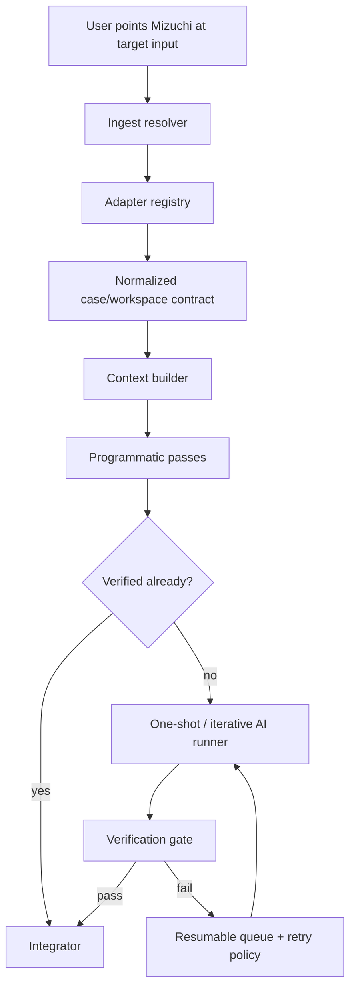
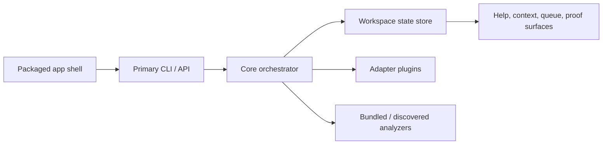

# feat: universal entrypoint app foundation

## Summary

Turn Mizuchi from an Odyssey-oriented matching-decompilation workspace into the first foundation of a self-contained, cross-platform, local-first reverse-engineering product with one primary entrypoint. The work should preserve the repo's proof-first discipline while generalizing ingest, orchestration, and packaging so the system can accept many target shapes without bespoke operator setup for each one.

---

## Problem Frame

The current repo is still shaped like a specialized workspace: strong on proof-first function matching, weak on universal target intake, packageable runtime boundaries, and single-entrypoint behavior. That keeps Mizuchi close to "manual Ghidra plus scripts, but faster" instead of becoming the product the strategy now names: one system that users can point at an application, normalize into a stable workspace contract, and run at scale without rebuilding the workflow by hand per target.

---

## Scope Boundaries

### In Scope

- Define the universal entrypoint product contract in repo docs and executable surfaces.
- Generalize the case/workspace contract beyond Odyssey-specific assumptions.
- Introduce a single primary CLI/runtime surface for ingest, orchestration, and verification.
- Add adapter-driven intake for multiple target-input shapes, with at least one non-Odyssey target family proving the abstraction.
- Design and scaffold the self-contained packaging/runtime layer needed for cross-platform distribution.
- Unify truthful state across prompt metadata, queue state, context injection, and help/discovery surfaces.

### Deferred for Follow-Up Work

- Full GUI shell or polished desktop UX.
- Broad target-family coverage beyond the first proof-of-generalization family.
- Fully automated whole-program source recovery for every target class.
- Real bundling of every heavy external dependency into release artifacts.

### Out of Scope

- Benchmark or leaderboard work.
- Repositioning Mizuchi as a semantic-only decompiler with no proof discipline.
- Claiming universal application support before the adapter and packaging model is proven.

---

## Requirements

- R1. Mizuchi exposes one primary entrypoint that a user can invoke without knowing the internal script graph.
- R2. The entrypoint accepts multiple target/input shapes and normalizes them into one stable workspace contract.
- R3. The normalized contract preserves proof-aware execution: one-shot and iterative passes may accelerate recovery, but verification remains authoritative.
- R4. The runtime no longer assumes Odyssey/KOTOR-specific target identity as the product boundary.
- R5. The repo defines a packageable, self-contained runtime shape for cross-platform distribution, even if the first slice only scaffolds it.
- R6. Agent and user discovery surfaces reflect the same truthful state and supported workflows.
- R7. The architecture proves generalization with at least one non-Odyssey adapter path and its validation fixtures.
- R8. Performance and long-running execution concerns are first-class: caching, resumability, queue truth, and bounded retries are part of the design, not later cleanup.

---

## Key Technical Decisions

- KTD1. **Single entrypoint over script federation:** introduce one primary product surface and demote the current script collection to implementation details or compatibility shims. This is the only path to a packageable product that feels like one system instead of a toolkit.
- KTD2. **Adapter-driven ingest over target-specific branching:** represent each target family behind an adapter contract so the core orchestrator consumes normalized cases instead of hardcoded binary/project assumptions.
- KTD3. **Case contract stays authoritative:** `case.yaml` evolves into the architecture-level source of truth for target identity, proof targets, runtime state, and ingest provenance. Target-local helper files remain secondary tool contracts.
- KTD4. **One-shot-first is a policy, not the proof model:** one-shot attempts can be the default acceleration path when context is sufficient, but they never replace verification or deterministic fallbacks.
- KTD5. **Self-contained runtime is a product boundary:** Mizuchi should converge on a local-first desktop/CLI orchestrator with isolated sidecars for heavyweight analyzers and verification tools. The runtime model must explicitly separate app-owned assets, external analyzers, cached artifacts, and operator workspaces so cross-platform shipping is possible.
- KTD6. **Truthful state beats optimistic throughput:** queue state, prompt state, context injection, and user-visible summaries must all derive from the same canonical state sources, even if that slows early orchestration work.

---

## Alternative Approaches Considered

- **Plugin-only product inside existing RE tools:** rejected as the primary shape because it keeps Mizuchi subordinate to whichever host tool the user already knows, and it does not solve self-contained packaging or unified orchestration across target families.
- **One monolithic decompiler engine:** rejected because current prior art suggests serious RE workflows still depend on specialist engines, loaders, and analyzers. Mizuchi should normalize and orchestrate them, not pretend one backend can replace them all.
- **Cloud-first orchestration service:** deferred because sensitive binaries, local toolchains, and reproducibility all argue for local-first execution in v1. Shared or remote layers may come later, but they should sit on top of a strong local runtime.

---

## High-Level Technical Design

The architecture separates three concerns that are currently interleaved in the repo: input normalization, recovery orchestration, and product packaging. The core orchestrator should only reason about normalized cases and canonical state; adapters own target-specific translation; the packaging layer owns how analyzers and runtimes are discovered, bundled, and launched.

---

## System-Wide Impact

- `AGENTS.md`, `README.md`, CLI help, and capability matrices will stop describing Mizuchi as an Odyssey-specific workflow and start describing it as a generalized entrypoint with current adapter coverage.
- Queueing, context injection, and verification surfaces will need one canonical state model; several current scripts will become consumers of shared readers instead of inventing their own prompt-state parsing.
- Packaging concerns become visible in-repo: release/runtime directories, installer assumptions, and dependency ownership can no longer stay implicit.

---

## Risks & Dependencies

- Ghidra, Rizin/Cutter, RetDec, and similar tools have very different execution and packaging shapes; the plan must keep them behind adapters rather than forcing one tool's model onto the whole product.
- Overclaim risk is high: "any possible application" is a product direction, not a v1 acceptance test. The plan must prove generalization incrementally instead of encoding universality rhetoric as a shipped promise.
- Cross-platform packaging can collapse under JVM/native/runtime sprawl if the app boundary does not distinguish bundled tools, optional tools, and user-provided tools clearly.
- Existing repo surfaces already drift on truthfulness and discovery; expanding product scope before unifying state contracts will amplify that drift.

---

## Sources & Research

- Current repo anchors:
  - `STRATEGY.md`
  - `docs/knowledgebase/10-architecture-runtime/reference-pipeline.md`
  - `docs/knowledgebase/10-architecture-runtime/workspace-contract.md`
  - `docs/knowledgebase/20-domain-theory/one-shot-decompilation-guidance.md`
  - `docs/knowledgebase/90-meta/evidence-caveats.md`
- External grounding:
  - Ghidra headless package docs: `https://ghidra.re/ghidra_docs/api/ghidra/app/util/headless/package-summary.html`
  - Cutter docs: `https://cutter.re/docs/index.html`
  - Cutter plugin model: `https://cutter.re/docs/plugins`
  - RetDec decompiler outputs and machine-readable output shapes: `https://github.com/avast/retdec/wiki/Decompiler-outputs`

---

## Implementation Units

### U1. Define the universal product contract

**Goal:** Replace the KOTOR/Odyssey-scoped product framing with a precise architecture contract for a universal single-entrypoint Mizuchi.

**Requirements:** R1, R3, R4, R5

**Dependencies:** none

**Files:**
- `STRATEGY.md`
- `README.md`
- `AGENTS.md`
- `docs/knowledgebase/00-intent/matching-decompilation.md`
- `docs/knowledgebase/10-architecture-runtime/reference-pipeline.md`
- `docs/knowledgebase/10-architecture-runtime/workspace-contract.md`
- `docs/knowledgebase/10-architecture-runtime/universal-entrypoint-architecture.md`

**Approach:** Add one new architecture doc that names the product boundary, supported runtime layers, and current adapter story; then update the repo's top-level docs so "Mizuchi" means the generalized product and not just the current Odyssey workflow.

**Patterns to follow:** Extend the existing knowledgebase structure instead of inventing a separate strategy/spec system.

**Test scenarios:**
- Happy path: documentation and help text consistently describe one primary entrypoint and adapter-driven ingest.
- Edge case: current Odyssey-specific capabilities remain documented as the first adapter family rather than disappearing.
- Error path: legacy docs no longer claim KOTOR/Odyssey as the product boundary.
- Integration: the product contract stays consistent across `STRATEGY.md`, `README.md`, `AGENTS.md`, and the architecture docs.

**Verification:** A new reader can understand Mizuchi as a generalized product without reading the old plan history, and the current Odyssey path is clearly presented as one adapter family rather than the whole product.

### U2. Generalize the case and ingest contract

**Goal:** Evolve prompt-local metadata into a normalized target/case model that can represent more than one target family or input shape.

**Requirements:** R2, R4, R7

**Dependencies:** U1

**Files:**
- `scripts/lib/case-manifest.sh`
- `scripts/validate-case-manifests.sh`
- `prompts/_template/case.yaml`
- `docs/knowledgebase/10-architecture-runtime/workspace-contract.md`
- `docs/knowledgebase/10-architecture-runtime/target-intake-contract.md`
- Manual verification: `./scripts/validate-case-manifests.sh --quiet` against
  real prompt folders, followed by inspecting the generated/normalized manifest.

**Approach:** Expand `case.yaml` from "prompt-local proof metadata" into a normalized intake contract with explicit target family, ingest source type, load context, proof source, and adapter selection fields. The adapter contract should stay narrow: `probe`, `normalize`, `materialize_workspace`, `toolchain_fingerprint`, `proof_spec`, and `capabilities`. Keep current fields compatible where possible, but add the missing layer that explains what the user pointed Mizuchi at and how that became a case.

**Patterns to follow:** Preserve the repo's machine-checkable contract style: small manifest, validator-backed, documented in the knowledgebase.

**Manual proof scenarios:**
- Happy path: an Odyssey-style binary input validates and normalizes successfully.
- Happy path: a second target family fixture validates through the same contract with a different adapter value.
- Edge case: input sources that resolve indirectly through extracted artifacts still record ingest provenance.
- Error path: missing adapter, missing proof target, or inconsistent case/settings values fail validation clearly.
- Integration: validators prove the same contract the docs describe.

**Verification:** `case.yaml` can describe at least two target families without target-specific hacks in the validator or docs.

### U3. Introduce the single primary entrypoint

**Goal:** Give Mizuchi one primary executable surface that owns ingest, orchestration, status, and verification commands.

**Requirements:** R1, R6

**Dependencies:** U1, U2

**Files:**
- `scripts/decomp-cli.sh`
- `scripts/help-command.sh`
- `scripts/validate-capability-parity.sh`
- `scripts/verify-workspace-surface.sh`
- `CAPABILITY_MATRIX.md`
- Manual verification: invoke `./scripts/decomp-cli.sh help`,
  `./scripts/decomp-cli.sh verify-surface --quiet`, and the equivalent Rust
  `decomp` commands once available.

**Approach:** Either evolve `decomp-cli.sh` into the canonical product entrypoint or add a new top-level wrapper and reduce the current file to compatibility shims. The important choice is that one command inventory becomes authoritative for help, parity checks, and user-facing workflow discovery.

**Patterns to follow:** Reuse the repo's existing CLI/help JSON pattern, but remove duplicated inventories and route generation through one metadata source.

**Manual proof scenarios:**
- Happy path: the primary entrypoint exposes ingest, queue, verify, and status surfaces from one help contract.
- Edge case: compatibility aliases still resolve for the old command names without becoming the source of truth.
- Error path: unsupported commands and unsupported adapter/input combinations fail with actionable messages.
- Integration: help output, parity validator, and capability docs are generated from the same command inventory.

**Verification:** There is one command surface the product can package and document as primary, and the repo no longer relies on several independently-maintained command inventories.

### U4. Add adapter registry and second-family proof

**Goal:** Prove that Mizuchi is not structurally locked to Odyssey by implementing the first non-Odyssey adapter path.

**Requirements:** R2, R4, R7

**Dependencies:** U2, U3

**Files:**
- `scripts/lib/target-adapters.sh`
- `scripts/lib/prompt-metadata.sh`
- `scripts/get-context.sh`
- `scripts/run-programmatic-phase.sh`
- `scripts/list-prompts.sh`
- `scripts/get-workspace-context.sh`
- Manual verification: run `list-prompts`, `get-workspace-context`, and
  adapter-backed context generation on real Odyssey and second-family cases.

**Approach:** Introduce an adapter registry layer that owns target-specific paths, proof lookup, context gathering hooks, load-context normalization, and derived-state helpers. Use it to migrate Odyssey-specific assumptions out of general scripts, then add a second adapter fixture so the abstraction is real. The orchestrator should consume normalized workspaces only; adapters own raw ingest quirks.

**Execution note:** Manually characterize the current Odyssey path with direct
CLI/tool runs before removing hardcoded assumptions from shared scripts.

**Patterns to follow:** Move duplicated prompt metadata readers into shared libraries before expanding behavior.

**Manual proof scenarios:**
- Happy path: both adapter families resolve their proof target and context hooks through the same registry.
- Edge case: blocked, matched, integrated, failed, and difficult states remain truthful after adapterization.
- Error path: unsupported family and missing adapter implementation fail early without corrupting queue state.
- Integration: `get-workspace-context`, `list-prompts`, and queue/bootstrap flows report the same canonical state.

**Verification:** Shared scripts no longer hardcode Odyssey-specific target assumptions, and a second adapter fixture passes through the same orchestration surfaces.

### U5. Unify proof-aware orchestration and truthful state

**Goal:** Make queue state, prompt state, context injection, and verification derive from one canonical model instead of drifting per script.

**Requirements:** R3, R6, R8

**Dependencies:** U3, U4

**Files:**
- `scripts/build-and-verify.sh`
- `scripts/vacuum.sh`
- `scripts/vacuum-cli.sh`
- `scripts/inject-context.sh`
- `scripts/get-workspace-context.sh`
- `scripts/list-prompts.sh`
- `scripts/validate-prompt-status.sh`
- Manual verification: run the actual build/verify/vacuum/context commands on a
  real prompt folder and inspect stdout JSON, stderr traces, generated objects,
  and proof reports.

**Approach:** Define one canonical state ownership rule for proof status, queue buckets, and injected agent context. Back that state with machine-owned records keyed by `caseId`, using disk-first artifacts for logs/build outputs and a lightweight index for scheduling, queue truth, and summaries. Then refactor scripts so they read shared helpers for target object resolution, prompt status, queue transitions, and match outcomes instead of carrying private state logic.

**Patterns to follow:** Preserve stderr tracing / stdout machine output separation, but remove duplicated state parsing and target-resolution logic. Prefer content-addressed caches and a SQLite-backed scheduler/index with WAL semantics over ad hoc prompt-note scraping.

**Manual proof scenarios:**
- Happy path: a verified match transitions consistently across queue state, prompt state, and injected context.
- Edge case: blocked prompts stay blocked across all discovery surfaces.
- Error path: infra failures, compiler failures, and proof mismatches are classified distinctly and do not masquerade as target failure.
- Integration: help/context/queue surfaces describe the same state to both users and agents.

**Verification:** No user-facing or agent-facing surface reports a different canonical state for the same case.

### U6. Scaffold self-contained packaging and runtime ownership

**Goal:** Define and partially implement the self-contained runtime layer needed to ship Mizuchi as one cross-platform product.

**Requirements:** R5, R8

**Dependencies:** U1, U3, U4

**Files:**
- `packaging/README.md`
- `packaging/runtime-layout.md`
- `scripts/check-health`
- `scripts/package-app.sh`
- `.compound-engineering/config.local.example.yaml`
- `README.md`
- `docs/knowledgebase/10-architecture-runtime/runtime-packaging.md`

**Approach:** Introduce explicit packaging/runtime ownership docs and a first packaging script or manifest that distinguishes bundled tools, discovered tools, optional tools, workspace data, and cache data. Use a sidecar-oriented model for heavyweight analyzers and verification tools, record per-platform tool manifests with version, hash, license, and source URL, and define which dependencies must be bundled versus fingerprinted. The goal is not final shipping, but making runtime ownership executable and reviewable.

**Patterns to follow:** Reuse the existing health-check/setup flow as the place where runtime ownership becomes visible to operators.

**Manual proof scenarios:**
- Happy path: packaged-runtime metadata distinguishes required bundled components from optional external tools.
- Edge case: missing optional tools degrade capability without making the whole app unusable.
- Error path: missing required runtime components fail startup/setup with explicit remediation.
- Error path: a stale or mismatched sidecar/tool fingerprint invalidates cache reuse and produces a clear rebuild path.
- Integration: setup/health reporting matches the packaging/runtime docs.

**Verification:** The repo has a concrete runtime ownership model that can be iterated into installers and release artifacts instead of leaving packaging as an implicit future step.

### U7. Add end-to-end manual target matrix for ingest and orchestration

**Goal:** Prove the new architecture on representative input shapes and long-running orchestration paths through direct tool runs and captured artifacts.

**Requirements:** R2, R3, R6, R7, R8

**Dependencies:** U2, U4, U5, U6

**Files:**
- `docs/knowledgebase/50-execution/playbook.md`
- `docs/plans/2026-06-12-004-production-decompilation-roadmap.md`
- Manual target workspaces under an ignored local scratch directory.

**Approach:** Maintain a manual target matrix for the normalized ingest contract,
truthful state propagation, and the primary entrypoint's top-level flows. Cover
both happy-path ingest and the failure modes most likely to break trust in a
"point Mizuchi at it" product.

**Patterns to follow:** Use real CLI/tool invocations, preserve stdout JSON and
stderr traces, and capture generated proof artifacts instead of adding automated
tests during this phase.

**Manual proof scenarios:**
- Happy path: supported input shapes normalize into cases and proceed through the primary entrypoint.
- Edge case: extracted/nested target inputs normalize into the same case layout as direct binary inputs.
- Error path: unsupported input shapes fail before partially mutating workspace state.
- Integration: end-to-end fixtures prove the product can ingest, report state, verify, and resume through the single entrypoint.

**Verification:** The repo has a repeatable manual proof matrix that exercises
the architecture as a product flow, not just isolated scripts.
